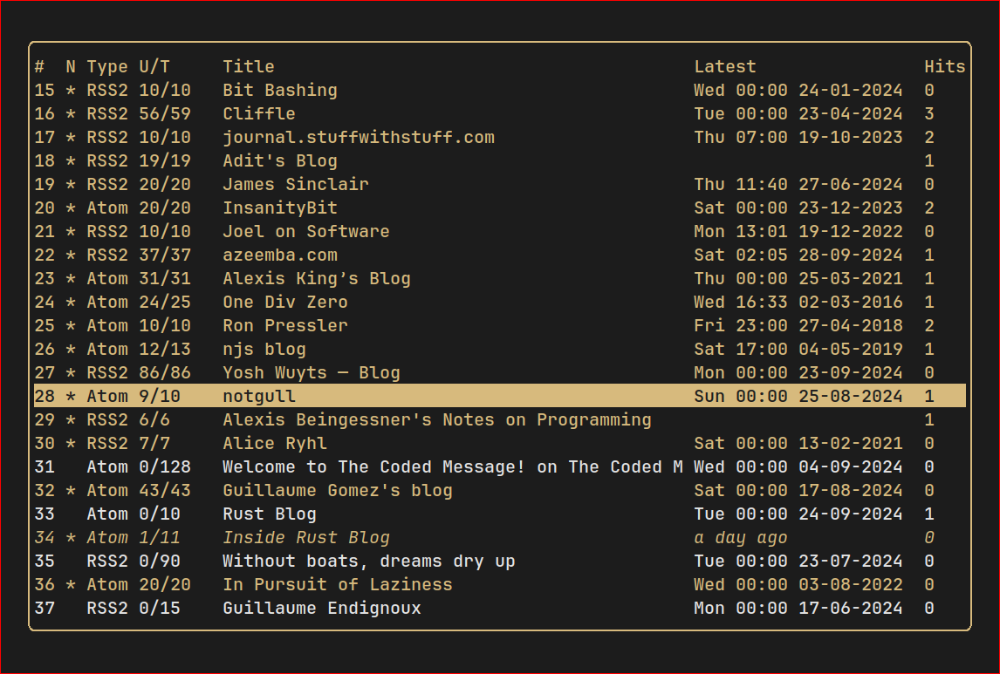

```toml
# $HOME/.config/rrss/config.toml

max_concurrency = 20

[theme]
date_format = "%a %H:%M %d-%m-%Y"
borders = false
column_spacing = 2
unread_marker = '•'
# ...

# [keybinds]
# cancel = ["todo"]
```

```toml
# $HOME/.config/rrss/sources.toml

[[sources]]
url = "..."
filter = { pattern = "cool regex", invert = false, case_insensitive = false }
max_items = 100

[[sources]]
# ...
```



todos
- sort by columns
- global search in all items and feeds
- export sources